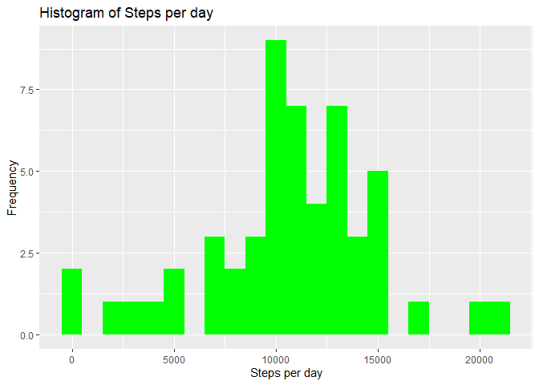
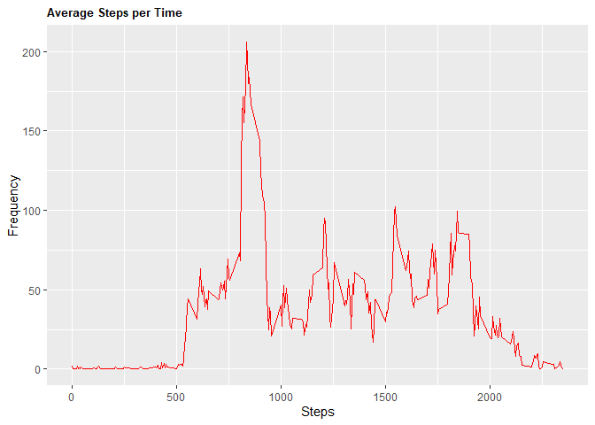
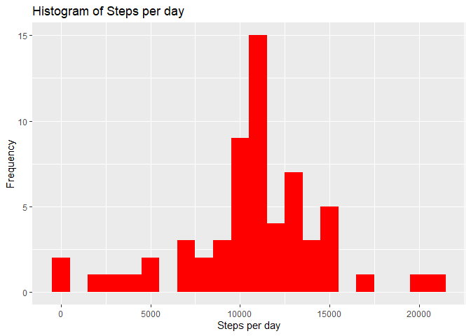
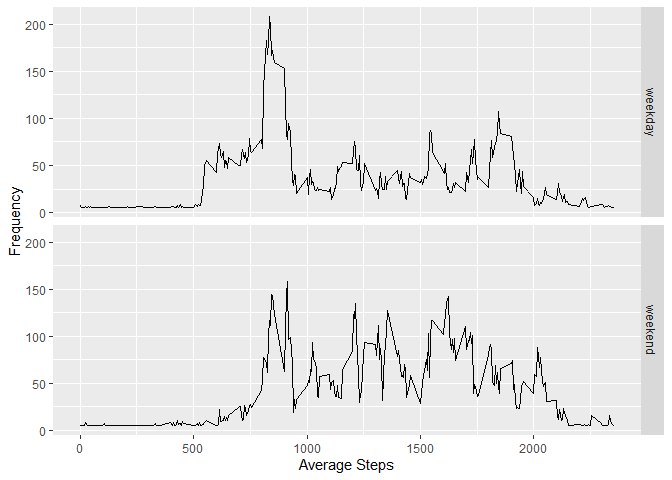

Programming Assignment
================

# Introduction

This assignment makes use of data from a personal activity monitoring
device. This device collects data at 5 minute intervals through out the
day. The data consists of two months of data from an anonymous
individual collected during the months of October and November, 2012 and
include the number of steps taken in 5 minute intervals each day

The data for this assignment can be downloaded from the course web site:
[Activity monitoring
data](http://d396qusza40orc.cloudfront.net/repdata%2Fdata%2Factivity.zip)

Load and unzip datasource

``` r
if(!file.exists("activity.csv")) {
  tempfile <- tempfile()
  download.file("http://d396qusza40orc.cloudfront.net/repdata%2Fdata%2Factivity.zip",destfile = tempfile)
  unzip(tempfile)
  unlink(tempfile)
}
```

# 1\. What is mean total number of steps taken per day?

1.1. read in csv file

``` r
activity <- read.csv("activity.csv", header = TRUE, sep = ',')
```

1.2 Calculate the total number of steps taken per day

``` r
stepsperday <- aggregate(steps ~ date, activity,sum, na.rm = TRUE)
```

1.3 Make a histogram of the total number of steps taken each day

``` r
library(ggplot2)
ggplot(stepsperday, aes(x = steps)) +
  geom_histogram(fill = "green", binwidth = 1000) +
  labs(title = "Histogram of Steps per day", x = "Steps per day", y = "Frequency")
```

<!-- -->

1.4 Calculate and report the mean and median of the total number of
steps taken per day

``` r
stepseachday <- tapply(activity$steps, activity$date, sum, na.rm=TRUE)

meanSteps <- mean(stepseachday)
medianSteps <- median(stepseachday)
  
meanSteps
```

    ## [1] 9354.23

``` r
medianSteps
```

    ## [1] 10395

# 2\. What is the average daily activity pattern?

2.1 Make a time series plot (i.e. type = “l”type = “l”) of the 5-minute
interval (x-axis) and the average number of steps taken, averaged across
all days (y-axis)

``` r
meanSteps_activity<- aggregate(steps ~ interval, activity, mean, na.rm = TRUE)
g <- ggplot(meanSteps_activity, aes(interval, steps))
g+geom_line(col = "red") + ggtitle("Average Steps per Time") + xlab("Steps") + ylab("Frequency")+ theme(plot.title = element_text(face="bold", size=10))
```

<!-- -->

2.2 Which 5-minute interval, on average across all the days in the
dataset, contains the maximum number of steps?

``` r
meanSteps_activity[which.max(meanSteps_activity$steps),]
```

    ##     interval    steps
    ## 104      835 206.1698

# 3\. Imputing missing values

3.1 Calculate and report the total number of missing values in the
dataset (i.e. the total number of rows with NAs)

``` r
totalna <- sum(is.na(activity$steps))
totalna
```

    ## [1] 2304

3.2 Devise a strategy for filling in all of the missing values in the
dataset. The strategy does not need to be sophisticated. For example,
you could use the mean/median for that day, or the mean for that
5-minute interval, etc.

``` r
library(Hmisc)
```

    ## Loading required package: lattice

    ## Loading required package: survival

    ## Loading required package: Formula

    ## 
    ## Attaching package: 'Hmisc'

    ## The following objects are masked from 'package:base':
    ## 
    ##     format.pval, units

``` r
activity_imputed_mean <- activity
activity_imputed_mean$steps <- impute(activity$steps, mean)
```

3.3 Create a new dataset that is equal to the original dataset but with
the missing data filled in.

``` r
##4. Make a histogram of the total number of steps taken each day
FullSteps <- aggregate(steps ~ date, activity_imputed_mean, sum)
```

3.4 Make a histogram of the total number of steps taken each day and
Calculate and report the mean and median total number of steps taken per
day. Do these values differ from the estimates from the first part of
the assignment? What is the impact of imputing missing data on the
estimates of the total daily number of steps?

``` r
ggplot(FullSteps, aes(x = steps)) +
  geom_histogram(fill = "red", binwidth = 1000) +
  labs(title = "Histogram of Steps per day", x = "Steps per day", y = "Frequency")
```

<!-- -->

# 4.Are there differences in activity patterns between weekdays and weekends

4.1 Create a new factor variable in the dataset with two levels –
“weekday” and “weekend” indicating whether a given date is a weekday
or weekend day

``` r
activity_imputed_mean$dateType <-  ifelse(as.POSIXlt(activity_imputed_mean $date)$wday %in% c(0,6), 'weekend', 'weekday')
```

4.2 Make a panel plot containing a time series plot of the 5-minute
interval (x-axis) and the average number of steps taken, averaged across
all weekday days or weekend days (y-axis). See the README file in the
GitHub repository to see an example of what this plot should look like
using simulated data.

``` r
activity_imputed_mean2 <- aggregate(steps ~ interval + dateType, activity_imputed_mean, mean)
ggplot(activity_imputed_mean2, aes(interval, steps)) + 
  geom_line() + 
  facet_grid(dateType ~ .) +
  xlab("Average Steps") + 
  ylab("Frequency")
```

<!-- -->
